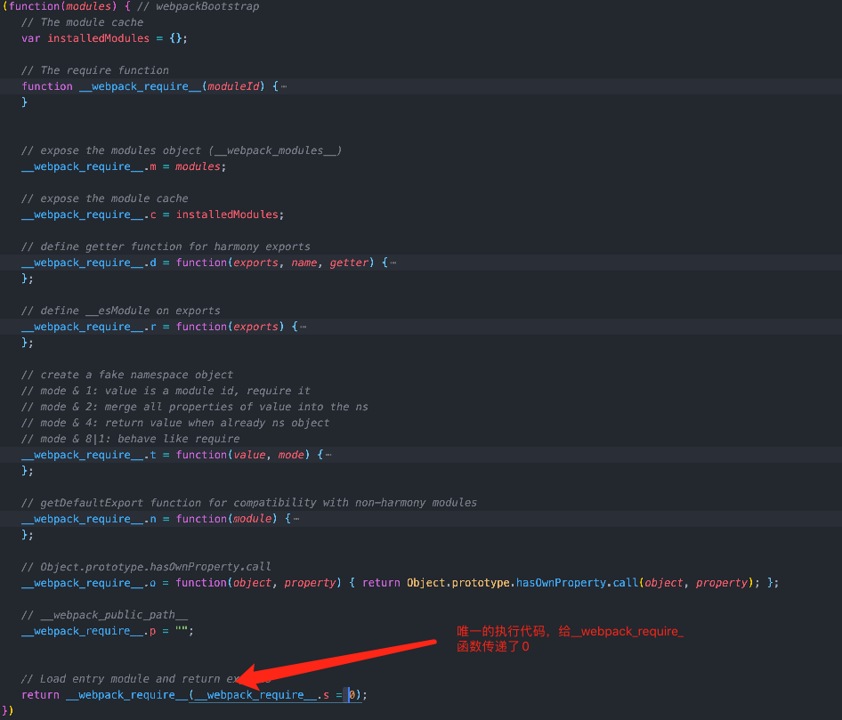

# 探寻下Webpack的打包的模块化机制

一直都不是很了解webpack的模块化原理，所以花时间看下。

## 环境

4.44.1

```json
"webpack": "^4.44.1",
"webpack-cli": "^3.3.12"
```

为了更好的阅读代码，打包模式`mode`设置为了`none`

## 同步模块

### 文件准备

- Index.js 也是我们的入口文件

```javascript
import text from './a.js';
document.body.innerText = text;
```

- a.js 导入的模块文件

```javascript
const a = 'hello world';
export default a;
```

代码很简单，就是入口文件导入a文件的变量，在放到body上

### 打包结果分析


可以看到，打包出来的文件，实际上是一个自执行函数，入参是两个`function`组成的数组`modules`，我称之为模块数组，第一个函数实际上就是`index.js`，第二个函数是`a.js`


接着，进入函数内部，初始化了一个对象变量，这是用来存储加载完毕的模块




进入函数内部，我们看到，基本上全是函数的定义，真正执行的只有最后一行，调用了`__webpack_require__`函数传递了参数0，同时将`__webpack_require__.s`赋值为了0


`__webpack_require__`函数，从名字中可以看出，这就是一个模块的加载函数。函数首先判断了模块是否被加载到`installedModules`中。如果没有被加载过，则新创建一个空的`module`，分别有id、是否加载过标识以及空的exports组成。然后执行模块数组中modules中对应id的函数，将刚才创建的`module`以及``__webpack_require__``函数创建去，返回module的export。**第一次执行，加载的是`modules[0]`，即模块数组中的第0个，入口模块index。**


> 上面在加载模块的时候，通过`modules[moduleId].call(module.exports, module, module.exports, __webpack_require__)`执行了对应的模块函数，我们在回头看下模块函数里做了哪些事


模块函数的执行，就是执行对应js中的代码，如果有代码里有`export.default`的，就会给对应的`module.exports`对象中添加`default`属性，如果有`exprot`的，就会给`module.exports`对象中添加对应导出的属性。


看下模函数中用到的webpack_require.r函数，就是给exports属性添加一个`Module`或`__esModule`标识。[`Symbol.toStringTag`](https://developer.mozilla.org/zh-CN/docs/Web/JavaScript/Reference/Global_Objects/Symbol/toStringTag)


这就是webpack打包出来的主要内容和运行方式。还有些工具方法这里就不细说了。


## 异步模块

异步加载也一样，我们照例准备好文件

### 文件准备

- index.js 入口文件

```javascript
import('./b').then(module => {
  const div = document.createElement('div');
  div.innerText = module.b;
  document.body.appendChild(div);
});
```

- b.js 用于被异步加载的文件

```javascript
const b = 'hello b';
export { b };
```


可以看到，这次打包出来的文件就不止一个了。


### 打包结果分析


通过chrome的debug，我们可以看到，刨除各种各样的赋值，初始化变量以及函数等操作，这次webpack的执行函数里多了这段代码。这段大致的逻辑就是将`window.webpackJsonp`初始化为一个数组，然后将其原本的`push`方法赋值给`parentJsonpFunction`变量，并且将`window.webpackJsonp`的push字段修改为`webpackJsonpCallback`这个函数。


接着，入口模块执行`__webpack_require__.e`，参数为1，进行b模块的导入


`__webpack_require__.e`函数内部，我们可以看到，它先从`installedChunks`这个对象里去取chunkId的值，而chunkId就是入口模块传递过来的1。并且返回的结果如果为0，代表已经安装过了，直接`return`


接下来就是创建一个promise，创建一个script标签，根据chunkId找到对应的模块路径。实际上就是通过script标签进行模块的加载与执行。`onScriptComplete`是错误处理函数


> 由于我的代码比较简单，只剩下import之后的逻辑，所有入口模块到这里就只剩下了导入文件之后的回调了，那么现在来看下`1.main.js`里有哪些内容


大家应该还记得`window.webpackJsonp`这个数组的`push`方法，实际上已经被改成了`webpackJsonpCallback`这个函数了，所以这里实际就是在执行`webpackJsonpCallback`，同时传递了一个数组，第一个是id数组，第二个就是模块函数，和前面讲的模块函数一样。

> 如果这里先于webpack更改push方法之前执行，这里的push就是正常的添加item方法，会将内容放到数组中，而webpack在对`window.webpackJsonp`进行装饰过后，会遍历当前数组的内容，分别执行`webpackJsonpCallback`


模块加载完毕了，执行回调。这里的逻辑主要就是解析模块，将模块函数存储到`modules`这个模块数组上，并且标记该模块已经被安装，然后执行加载该模块钱创建的`promise`的`resolve`方法。


> :warning: 注意，chunkId和moduleId分别是异步安装的模块id和存入modules数组的模块id。
>
> moduleId为1时，webpack是直接将其存储到一个数组里， 下标是1。如果不是1，则存储到对象了，key就是id
>
> 


`resolve`执行，触发`then`函数，调用`__webpack_require__`调用id为1的模块，也就是我们刚刚导入的模块 b.js。接着就和同步一样了，导入完模块，执行我们的代码。


到这里，模块加载就执行完毕了。

