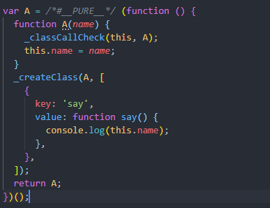
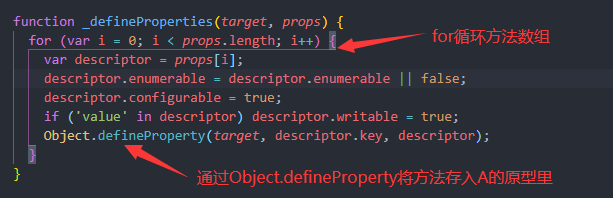
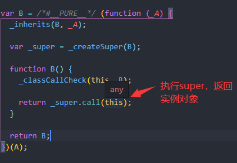

# 探索下es6的class以及继承的原理

## 前言

在javascript中，生成实例对象的方法是创建一个函数，再用new的方式实例化这个函数的对象。这种方案和传统语言区别很大，容易让人感到困惑。es6提供了一种更接近于传统语言的写法：class。不过，class可以看作是语法糖，它的绝大部分功能，ES5 都可以做到。下面，我们就来探究下class在es5下是如何实现的。

## es6的写法

```javascript
class A {
  constructor(name) {
    this.name = name;
  }

  say() {
    console.log(this.name);
  }
}

class B extends A {
  constructor() {
    super();
  }
}
```

这里我们定义了两个类，A和B，B继承于A。

接下来，我们在babel转义下，得到如下代码

```javascript
var A = /*#__PURE__*/ (function () {
  function A(name) {
    _classCallCheck(this, A);
    this.name = name;
  }
  _createClass(A, [
    {
      key: 'say',
      value: function say() {
        console.log(this.name);
      },
    },
  ]);

  return A;
})();

var B = /*#__PURE__*/ (function (_A) {
  _inherits(B, _A);
  var _super = _createSuper(B);
  function B() {
    _classCallCheck(this, B);
    return _super.call(this);
  }
  return B;
})(A);
```

可以看到，class实际还是由function来做的实现

## 类的实现原理

我们通过 A，来看下class的实现原理




首先，为变量A赋值了一个自执行函数，在这个函数中返回了内部定义的function A，所以**变量A就是一个function**。

接着，函数内部除了为实例赋值外，还调用了`_classCallCheck(this,A)`

```javascript
function _classCallCheck(instance, Constructor) {
  if (!_instanceof(instance, Constructor)) { // 等同于 !(this instanceof A)
    throw new TypeError('Cannot call a class as a function');
  }
}
```

即如果你不是用new关键字来调用函数的话，`this instanceof A`就会是false，取反结果为true，抛出异常。这就是为什么class不能直接作为一个函数来执行。

### _createClass

接下来，在函数创建完成后，又调用了`_createClass`方法，这个方法传递了两个值，第一个为**函数A**，第二个是一个**数组**，里面包含着我们在class A中定义的**函数say**。

```javascript
function _createClass(Constructor, protoProps, staticProps) {
  if (protoProps) _defineProperties(Constructor.prototype, protoProps);
  if (staticProps) _defineProperties(Constructor, staticProps);
  return Constructor;
}

function _defineProperties(target, props) {
  for (var i = 0; i < props.length; i++) {
    var descriptor = props[i];
    descriptor.enumerable = descriptor.enumerable || false;
    descriptor.configurable = true;
    if ('value' in descriptor) descriptor.writable = true;
    Object.defineProperty(target, descriptor.key, descriptor);
  }
}
```

```javascript
 if (protoProps) _defineProperties(Constructor.prototype, protoProps);
```

通过`_createClass`我们会执行这里的`_defineProperties`，为它传递两个参数，其中，Constructor就是函数A，所以第一个参数等于A.prototype，第二个参数就是存着say方法的数组



这里就是遍历存储方法数组，然后将对应的方法用  **[Object.defineProperty](https://developer.mozilla.org/zh-CN/docs/Web/JavaScript/Reference/Global_Objects/Object/defineProperty)** 存入 **target** 即 **A.prototype**上

**最后，自执行函数返回A，变量A就被赋值为function A，同时，function A的prototype上有say方法**

## 继承的原理

```javascript
var B = /*#__PURE__*/ (function (_A) {
  _inherits(B, _A);
  var _super = _createSuper(B);
  function B() {
    _classCallCheck(this, B);
    return _super.call(this);
  }
  return B;
})(A);
```

可以看到，B和A一样，也是一个自执行函数，不过B有一个参数，就是函数A

B的自执行函数首先会执行`_inherits(B, _A)`

```javascript
function _inherits(subClass, superClass) {
  if (typeof superClass !== 'function' && superClass !== null) {
    throw new TypeError('Super expression must either be null or a function');
  }
  subClass.prototype = Object.create(superClass && superClass.prototype, {
    constructor: { value: subClass, writable: true, configurable: true },
  });
  if (superClass) _setPrototypeOf(subClass, superClass);
}

function _setPrototypeOf(o, p) {
  _setPrototypeOf =
    Object.setPrototypeOf ||
    function _setPrototypeOf(o, p) {
      o.__proto__ = p;
      return o;
    };
  return _setPrototypeOf(o, p);
}
```

这里，首先让 `B.prototype._proto_ = A.prototype`，并且constructor指向B。接着，执行`_setPrototypeOf`，让`B._proto = A`。

所以，`_inherits`就是为了构造B与A之间的原型链

### super

接下来，就是创建super

```javascript
var _super = _createSuper(B);

function _createSuper(Derived) {
  var hasNativeReflectConstruct = _isNativeReflectConstruct();
  return function _createSuperInternal() {
    var Super = _getPrototypeOf(Derived),
      result;
    if (hasNativeReflectConstruct) {
      var NewTarget = _getPrototypeOf(this).constructor;
      result = Reflect.construct(Super, arguments, NewTarget);
    } else {
      result = Super.apply(this, arguments);
    }
    return _possibleConstructorReturn(this, result);
  };
}

function _isNativeReflectConstruct() {
  if (typeof Reflect === 'undefined' || !Reflect.construct) return false;
  if (Reflect.construct.sham) return false;
  if (typeof Proxy === 'function') return true;
  try {
    Date.prototype.toString.call(Reflect.construct(Date, [], function () {}));
    return true;
  } catch (e) {
    return false;
  }
}

function _possibleConstructorReturn(self, call) {
  if (call && (_typeof(call) === 'object' || typeof call === 'function')) {
    return call;
  }
  return _assertThisInitialized(self);
}

function _assertThisInitialized(self) {
  if (self === void 0) {
    throw new ReferenceError(
      "this hasn't been initialised - super() hasn't been called"
    );
  }
  return self;
}
```

**[Reflect](https://es6.ruanyifeng.com/?search=Reflect&x=15&y=12#docs/reflect)** 是es6新的操作对象的api，前面是为了判断Reflect是否可以，可以用就使用Reflect。我们先不关注Reflect，直接看Reflect不可用的逻辑

```javascript
 var Super = _getPrototypeOf(Derived) // 获取Derived的原型，即B的原型A
result = Super.apply(this, arguments); // 执行A，传递的参数是this实例以及arguments
```

可以看到，`_createSuper`会返回一个方法，这个方法会执行当前函数的原型，即会执行A。也就是借用构造函数的继承方式。这也就是为什么子类必须在`constructor`方法中调用`super`方法，因为子类自己的`this`对象，必须先通过父类的构造函数完成塑造，得到与父类同样的实例属性和方法。

最后会通过`_possibleConstructorReturn`判断父函数的执行是否会返回一个对象，如果是个对象的话，最终返回父函数返回的对象。



## 总结

这些基本上就是es6的继承原理。

第一次写文章，写的不好，请大家多多包涵，如果文章中出现问题，欢迎评论或者私信，我会及时改正。