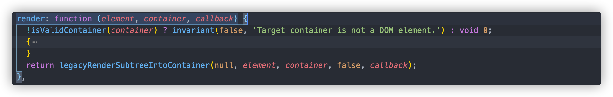

# 探索下react的渲染过程

## 序言

一直以来，对于react渲染过程的了解都是知其然不知其所以然，虽然在网上看了不少资料，但是总是看过就忘。这次就借着梳理的机会，一步步的走下react的渲染过程。

我所使用的版本为"react": "16.8.6", "react-dom": "16.8.6"。

## 开始

我目前看的教程，里面将react的渲染过程分为了三个阶段：legacyRenderSubtreeIntoContainer开始，直到scheduleUpdateOnFiber为初始化阶段，scheduleUpdateOnFiber到commitRoot为render阶段，commitRoot以后为commit阶段。个人觉得还是很有道理，所以我也就按照这个思路来进行梳理。

### 初始化阶段

#### render函数

首先当然是从我们熟悉的react的入口render来开始

render位于react-dom包内，在render函数里，去除一些对于组件和dom的判断，实际仅仅是调用了一个函数