# 探索下react的渲染过程

## 序言

一直以来，对于react渲染过程的了解都是知其然不知其所以然，虽然在网上看了不少资料，但是总是看过就忘。这次就借着梳理的机会，一步步的走下react的渲染过程。

我所使用的版本为"react": "16.8.6", "react-dom": "16.8.6"。

## 开始

我目前看的教程，里面将react的渲染过程分为了三个阶段：legacyRenderSubtreeIntoContainer开始，直到scheduleUpdateOnFiber为初始化阶段，scheduleUpdateOnFiber到commitRoot为render阶段，commitRoot以后为commit阶段。个人觉得还是很有道理，所以我也就按照这个思路来进行梳理。

### 初始化阶段

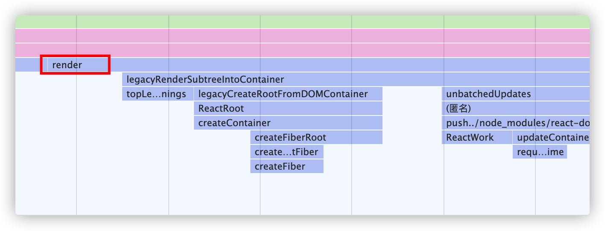

通过查看调用栈，我们进入到了一个非常熟悉的函数，render函数

#### render函数

render位于react-dom包内，在render函数里，去除一些对于组件和dom的判断，实际仅仅是调用了一个函数`legacyRenderSubtreeIntoContainer`。这个函数的参数如下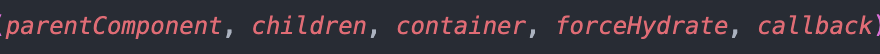

可以看到render的入参，`element`、`container`和`callback`透传给了`legacyRenderSubtreeIntoContainer`，分别作为`children`，`container`和`callback`。

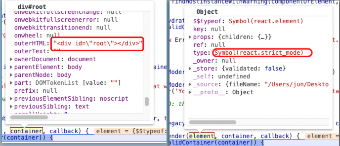

那么这里的element和container是什么呢？我们通过断点可以发现，**`container`是id为root的div**，**`element`则是我们代码里调用的`ReactDOM.render`里的第一个子元素`React.StrictMode`**。即container就是我们的容器，element则是我们的第一个元素。

#### legacyRenderSubtreeIntoContainer

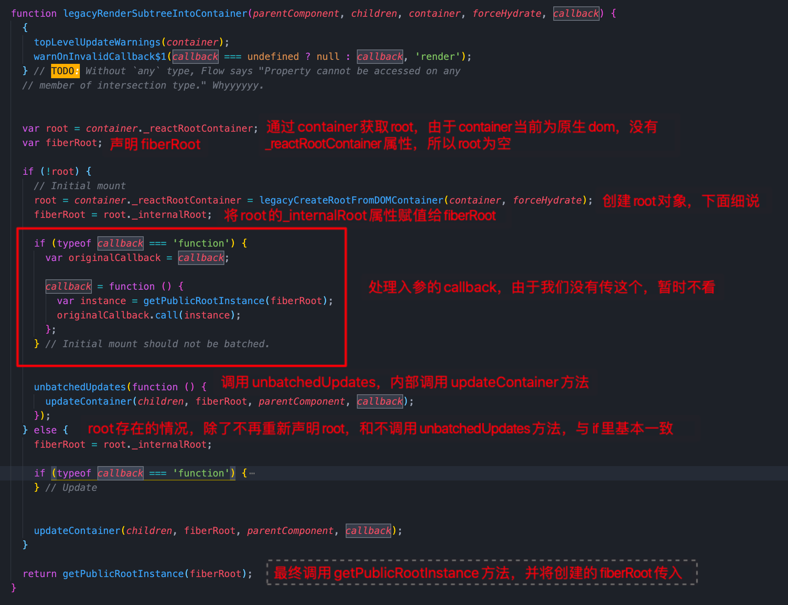

上面的代码主要目的是为了创建fiberRoot对象，并且在接下来使用fiberRoot对象。那么这个对象究竟是什么呢？我们得先来到root的创建地点，`legacyCreateRootFromDOMContainer`函数中

#### legacyCreateRootFromDOMContainer

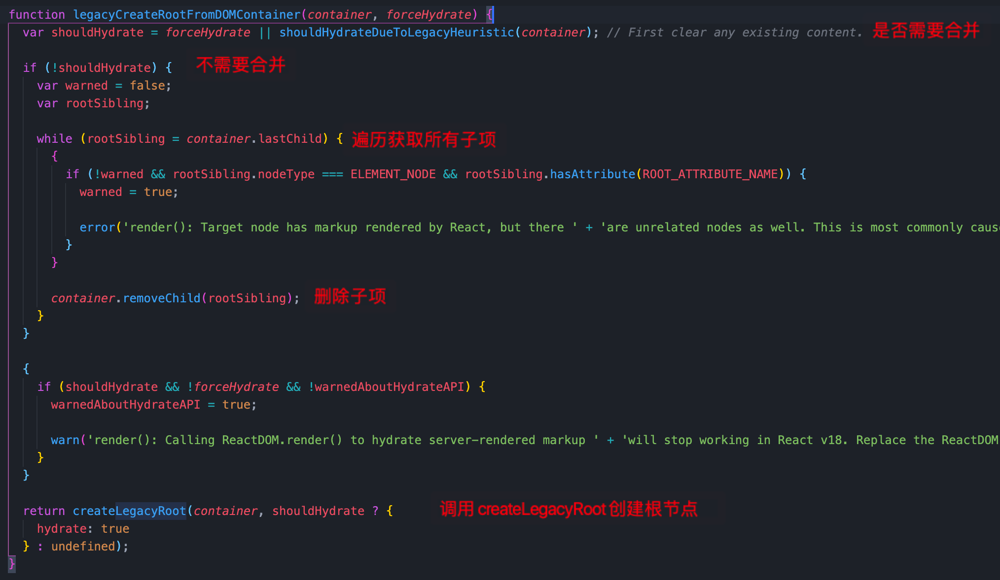

#####legacyCreateRootFromDOMContainer的内容

这个函数很有意思，函数名翻译过来是通过dom容器来创建根节点，但是整体内容做的是删除的事。他通过参数`forceHydrate`和函数`shouldHydrateDueToLegacyHeuristic`来判断是否需要合并，如果不需要合并，则删除当前容器下的子节点。然后调用`createLegacyRoot`继续创建root。

我们知道，在前面调用的时候，`forceHydrate`已经被赋值为了false，所以判断是否需要合并只剩下一个未知条件，即`shouldHydrateDueToLegacyHeuristic`函数。

##### shouldHydrateDueToLegacyHeuristic

代码第一行，就调用了这个函数来作为一个条件的赋值，我们先来看看这个函数是做什么的。

这个函数实际上是为了判断需不需要合并子节点元素。

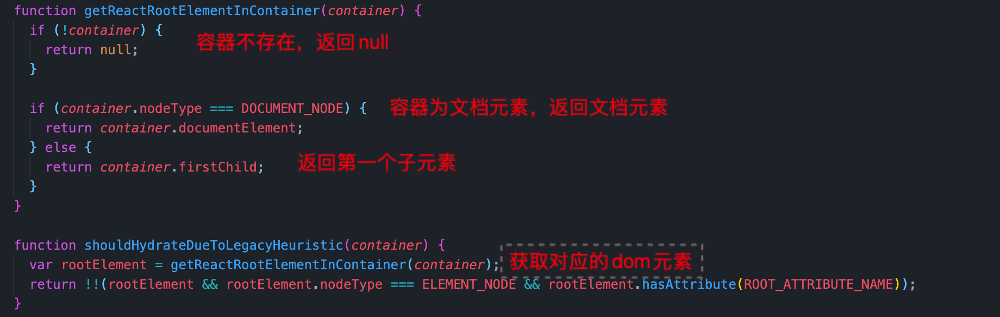

这个函数在容器不存在时，返回false。在容器为文档节点时，由于nodeType不是ELEMENT_NODE，也返回false。在容器为普通元素时，如果容器没有子元素，返回false；如果容器有子元素节点时，判断是否有属性`data-reactroot`，没有返回false。**也就是说，只有子元素节点含有属性`data-reactroot`这一种情况，才需要合并**。

在本项目中，由于没有子元素节点，直接返回false

#### root对象

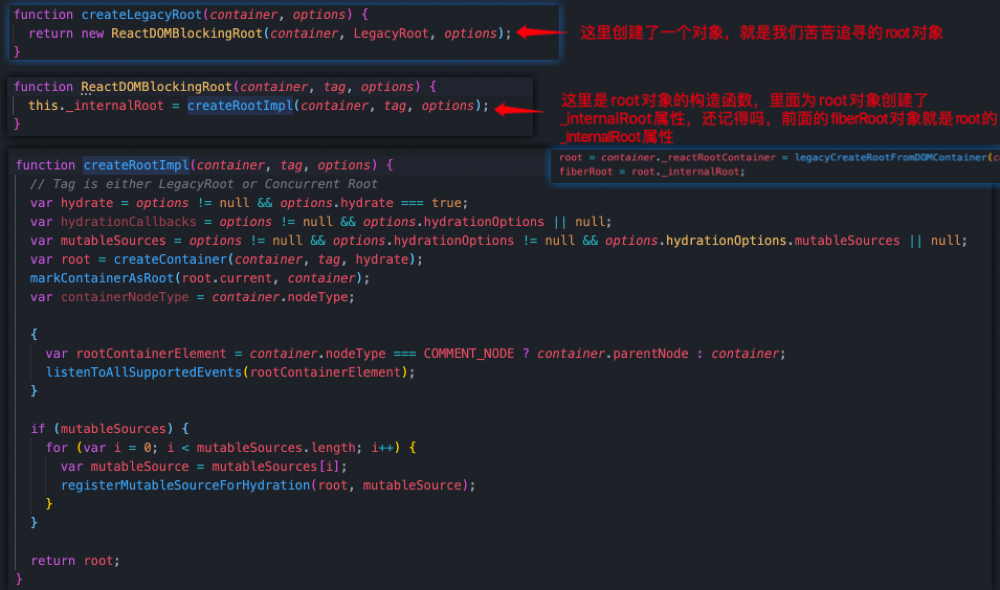

接下来，经过层层调用，最终进入到了这个函数内，这里我们总算见到我们苦苦追寻的对象root。在createLegacyRoot函数中，**使用了`new ReactDOMBlockingRoot`，创建了root对象**。同时，在构造函数中，我们也发现了fiberRoot的由来。

#### fiberRoot对象

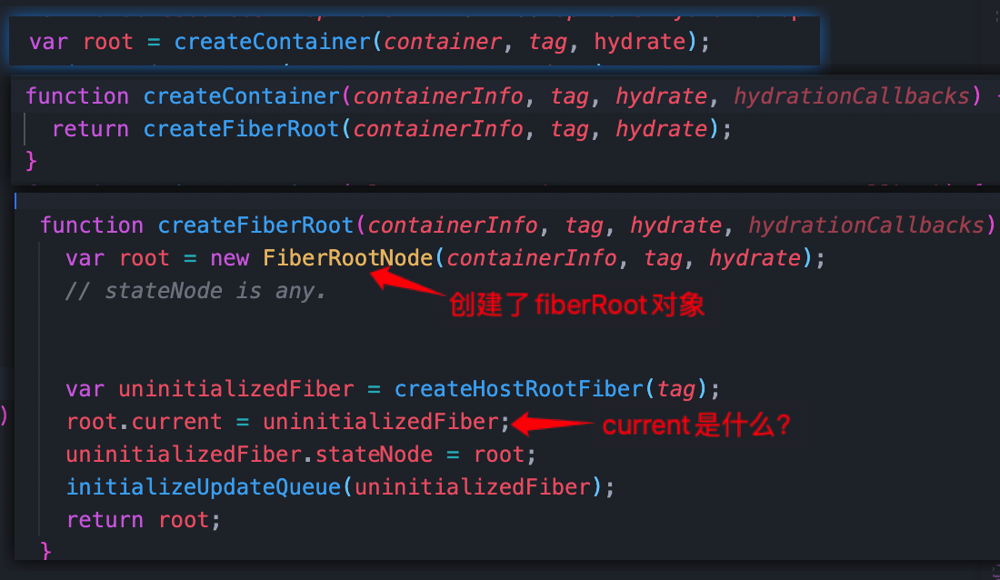

在往下探寻，可以发现，fiberRoot对象是通过`new FiberRootNode`生成的。同时，给fiberRoot赋值了一个current属性，那么这个current属性是什么？

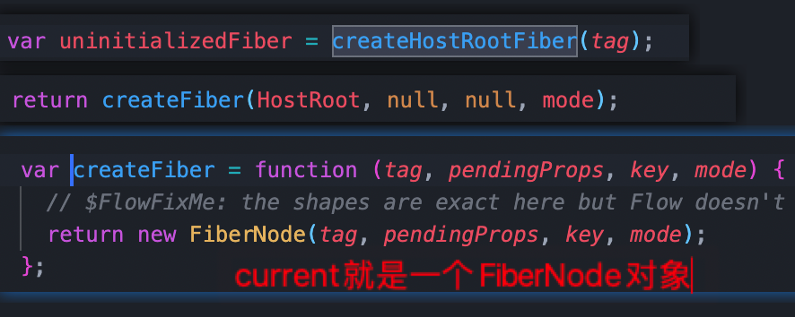

我们可以看到，**fiberRoot对象的current就是一个FiberNode对象**

**现在我们可以梳理一下目前所创建的对象之间的关系，首先，是我们的dom容器container，container上有一个_reactRootContainer属性，是我们的root（ReactDOMBlockingRoot）对象，root对象上有一个_internalRoot属性，是fiberRoot（FiberRootNode）对象，而在fiberRoot上有current属性，是一个rootFiber（FiberNode）对象。**如下图所示：

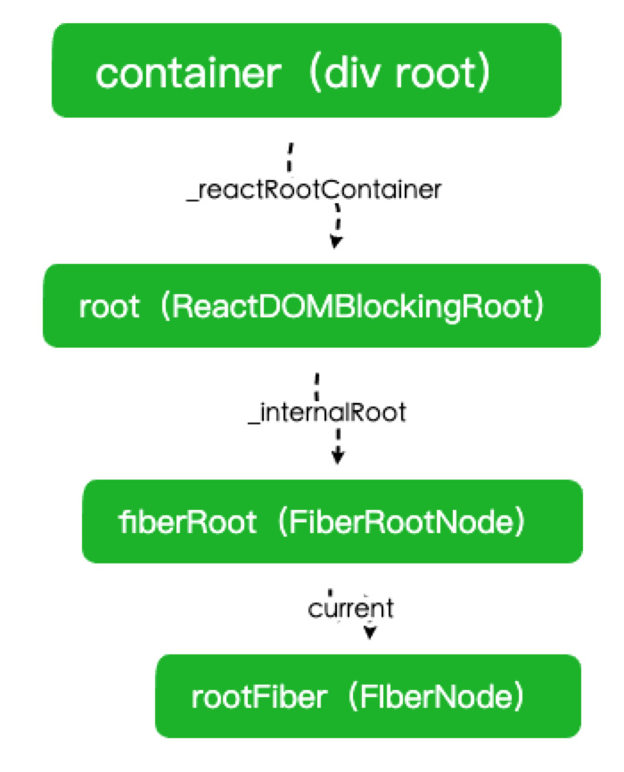

这样，我们就串联起了**dom节点和fiber根节点rootFiber。**既然dom树和fiber树之间有了联系，那我们接下来就应该先把fiber树整出来。

#### unbatchedUpdates

回到最初的起点legacyRenderSubtreeIntoContainer，在创建完fiberRoot之后，我们应该要执行unbatchedUpdates这个方法

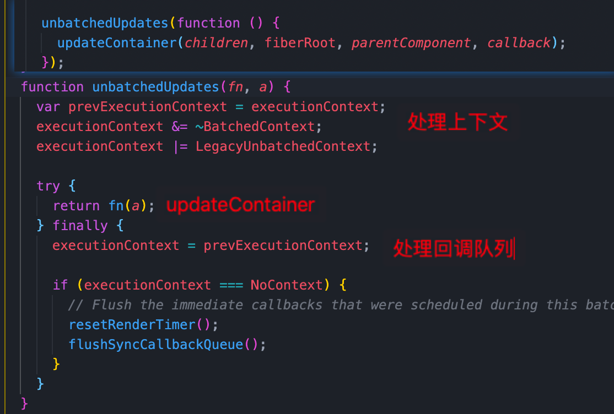

这里，我们先不关注对于上下文和回调队列的处理，可以看到，重点是执行了fn这个函数，而这里的fn，就是前面被包装了一层的updateContainer方法

#### updateContainer

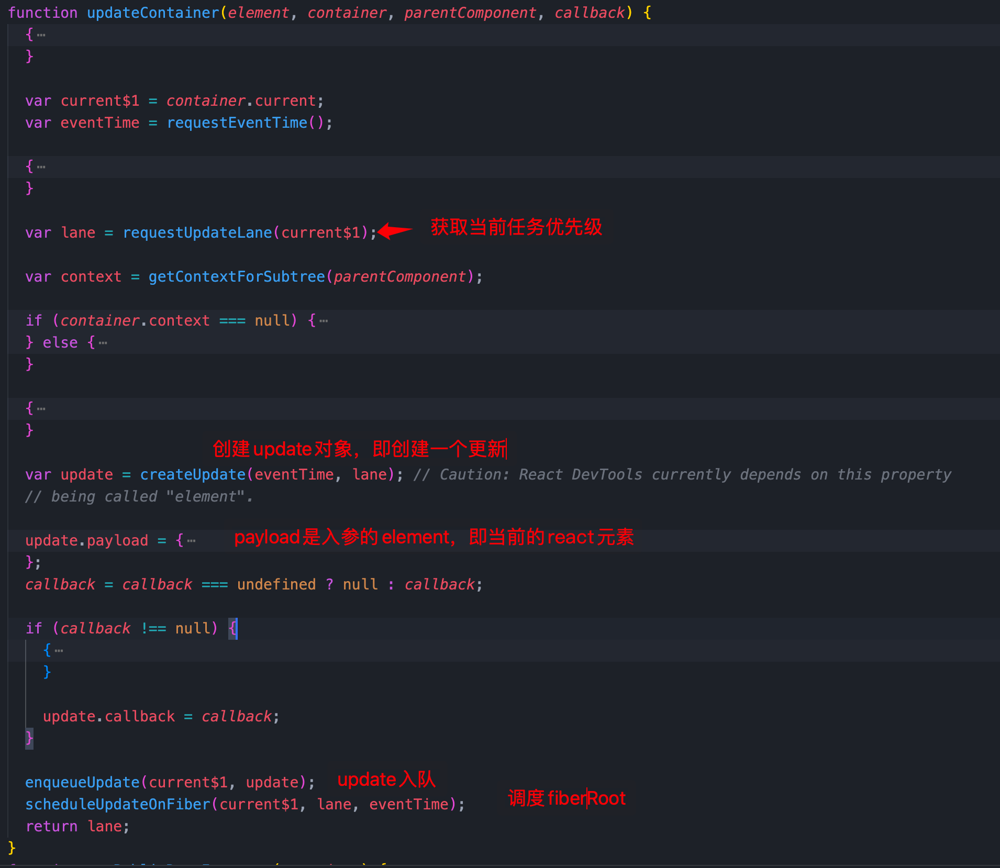

updateContainer主要救赎做了三件事

- 获取优先级lane
- 创建update对象，并放入队列
- 调度当前节点

#### scheduleUpdateOnFiber

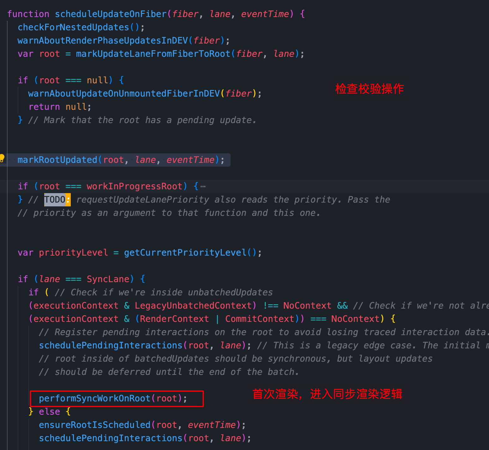

在scheduleUpdateOnFiber中，经过了一系列的校验，检查后，因为我们首次渲染，所以我们会进入到同步渲染中，即performSyncWorkOnRoot。同时，这也标志我们的准备工作做的差不多了，即将**进入render阶段**

> 这里之所以使同步，还因为我们的入口使用的是legacy 模式，即ReactDOM.render(<App />, rootNode)。这是当前 React App 使用的方式，当前没有计划删除本模式，但是这个模式可能不支持这些新功能。

