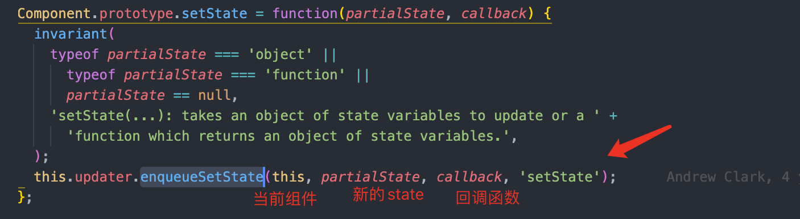
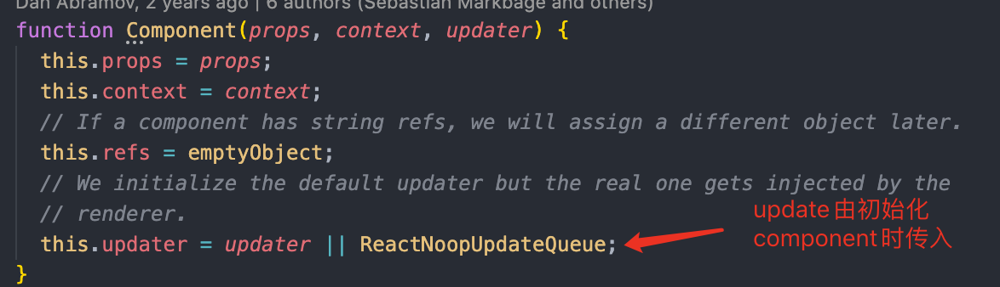

<!--
 * @Author: jun.fu<fujunchn@qq.com>
 * @LastEditors: jun.fu<fujunchn@qq.com>
 * @Description: file content
 * @Date: 2020-10-16 00:29:17
 * @LastEditTime: 2020-12-23 10:45:57
 * @FilePath: /notes/docs/javascript/探索下setState的原理.md
-->

# 探索下 setState 的原理

setState,实际执行 enqueueSetState

## enqueueSetState

要查看 enqueueSetState，首先得要找到 this.updater,我们可以看到，this.updater 是在 Component 的构造函数里赋值的。
