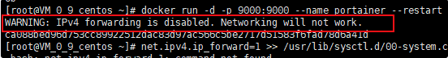

# 搭建代理服务器

因为公司为了所谓的网络完全，将很多网站都进行了屏蔽，包括我常用的网易云。天天没得歌听很烦躁，正巧手里有个腾讯云服务器，所以决定搭个代理服务器来绕开公司的墙。

## 准备工作

- 云服务器一台

## 服务器安装 shadowsocks-libev

这是一个服务器的代理软件，详细文档可以看[shadowsocks-libev](https://github.com/shadowsocks/shadowsocks-libev/blob/master/docker/alpine/README.md)

### 安装镜像

```shell
docker pull shadowsocks/shadowsocks-libev
```

### 运行服务器

```shell
docker run -e PASSWORD=9MLSpPmNt -p 8388:8388 -p 8388:8388/udp -d --restart always shadowsocks/shadowsocks-libev
```

> :warning:   出现IPv4 forwarding is disabled. Networking will not work 



- 首先，打开配置文件

```shell
vim /etc/sysctl.conf
# 或
vi /usr/lib/sysctl.d/00-system.conf 
```

- 添加或修改配置

```shell
net.ipv4.ip_forward=1 
```

- 重启服务

```shell
systemctl restart network  
```

> :warning:   腾讯云可能会重启服务失败，我的方案是直接重启服务器:(

- 查看是否重启成功

```shell
sysctl net.ipv4.ip_forward  
```

如果返回为“net.ipv4.ip_forward = 1”则表示成功了 重启容器即可。 

#### 也可以使用docker-componse

配置docker-componse.yml

```shell
shadowsocks:
  image: shadowsocks/shadowsocks-libev
  ports:
    - "8388:8388"
  environment:
    - METHOD=aes-256-gcm
    - PASSWORD=9MLSpPmNt
  restart: always
```

#### 

## 客户端安装shadowsocks

github搜索shadowsocks下载软件即可

- [mac](https://github.com/shadowsocks/ShadowsocksX-NG/releases/tag/v1.9.4)
- [android](https://github.com/shadowsocks/shadowsocks-android/releases)
- [windows](https://github.com/shadowsocks/shadowsocks-windows/releases)

> :warning:  ios​在github上没找到，可以去外区商店找对应软件

### 配置shadowsocks

安装完成后在软件中添加服务器，配置对应的数据就行

```json
{
    "server": "your-vps-ip", // 服务器ip
    "server_port": 8388, // 服务器端口号
    "local_address": "0.0.0.0",
    "local_port": 1080,
    "password": "9MLSpPmNt", // 服务器shadowsocks-libev配置的密码
    "timeout": 600, // 超时时间
    "method": "aes-256-gcm" // 加密方式，跟服务器配置的一致，默认为aes-256-gcm
}
```

## 使用

打开shadowsocks即可

- 全局模式

>  将会代理所以的请求，自测可用

- pac模式

>  只会代理配置的路径请求
>
> :warning:  我的pac还没整明白，目前使用不了这种方式，有知道的大佬希望能告知一下

